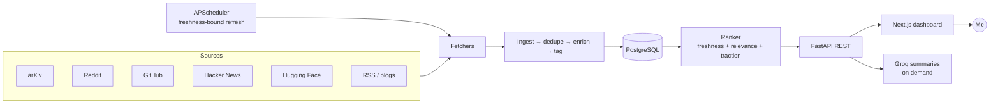

# NeuralFeed

**A personal AI-news intelligence dashboard.** One place that tracks everything moving in AI — research, code, social, and company blogs — ranks it by relevance, and links you straight to the source.

> ⚠️ **This is a personal, single-user project.** I built NeuralFeed for my own daily use as a portfolio piece. It runs as a single-user instance (auth exists only to protect *my* feed and preferences) — it is **not** a multi-tenant SaaS and isn't intended for public sign-ups.

[**Live demo**](https://neuralfeed.vercel.app) · [Backend API](https://neuralfeed-api.onrender.com/health)

<!-- Add screenshots here once captured -->
<!--  -->

---

## The problem

AI moves fast enough that missing two weeks means falling behind. Every useful source — arXiv, Reddit, GitHub, Hugging Face, company blogs — lives on a different platform engineered to keep you *inside* it. NeuralFeed inverts that: it fetches the signal, dedupes and ranks it, and sends you to the original source. You never read content here; NeuralFeed only decides *which* content deserves your attention today.

## What it does

- **Aggregates** from arXiv, Reddit, GitHub Trending, Hacker News, Hugging Face (papers/models/spaces), YouTube, and company/blog RSS feeds.
- **Deduplicates** stories across sources (URL-exact + title-similarity).
- **Ranks freshness-first** with a relevance + traction signal, so the feed is finite and noise-free — no infinite doom-scroll.
- **Summarizes on demand** via an LLM (Groq) — a structured deep brief, generated transiently and cached, never storing full article text.
- **Learns** from thumbs up/down to re-weight future items.
- **Curator, not a copy machine** — stores only metadata (title, URL, source, date, snippet, image URL). Never full text or third-party images.

## Tech stack

| Layer | Technology |
|---|---|
| Frontend | Next.js 15 (App Router, React 19), Tailwind CSS, TanStack Query |
| Backend | Python FastAPI (async, fully type-annotated), SQLAlchemy 2.x |
| Scheduling | APScheduler (in-process) |
| Database | SQLite (dev) → PostgreSQL / Neon (prod) |
| Summaries | Groq LLM (Ollama for offline dev) |
| Auth | JWT (HS256), PBKDF2 password hashing |
| Hosting | Vercel (frontend) · Render (backend) · Neon (Postgres) |
| Tooling | `uv` (Python), `bun` (frontend), Ruff, pytest, Vitest |

## Architecture



## Engineering highlights

- **Async throughout** — non-blocking FastAPI + async SQLAlchemy; concurrent fetches.
- **Resilient fetchers** — exponential backoff on 429/503, `Retry-After` honored, descriptive user agents.
- **Freshness guarantee** — scheduler clamps every source's fetch interval so the feed never goes stale.
- **Security as a first-class concern** — JWT auth, PBKDF2 (600k iterations), per-IP rate limiting, locked CORS, HSTS / nosniff / frame-deny headers, all reads/writes scoped to the owner.
- **Tested** — ~84% backend coverage (pytest), component smoke tests on the frontend (Vitest).

## Project structure

```
backend/          FastAPI service
  app/
    api/v1/        REST route handlers
    fetchers/      One module per source (arXiv, Reddit, GitHub, HN, HF, RSS, …)
    services/      Ingest, dedupe, ranker, relevance, summarizer, topic-tagger, …
    models/        SQLAlchemy models
    core/          Config, DB, scheduler, rate limiting, caching
  tests/
frontend/         Next.js 15 app (feed, discover, sources, topics, settings)
docs/             Roadmap, source registry, ADRs
```

## Running locally

**Backend**
```bash
cd backend
cp .env.example .env        # add your GROQ_API_KEY (free at console.groq.com)
uv sync
uv run uvicorn app.main:app --reload
```

**Frontend**
```bash
cd frontend
echo "NEXT_PUBLIC_API_URL=http://localhost:8000" > .env.local
bun install
bun dev
```

Open http://localhost:3000. On first run the backend seeds the source registry and the scheduler begins fetching.

## Status & roadmap

Live and in daily personal use. Next planned work: an "Apple News / Artifact" style front-page redesign (hero story, themed topic sections, full-screen reader). See [`docs/ROADMAP.md`](docs/ROADMAP.md).

---

*Built by [Atharv Motghare](https://github.com/rvzaku) as a personal project. Not affiliated with any of the sources it aggregates.*
