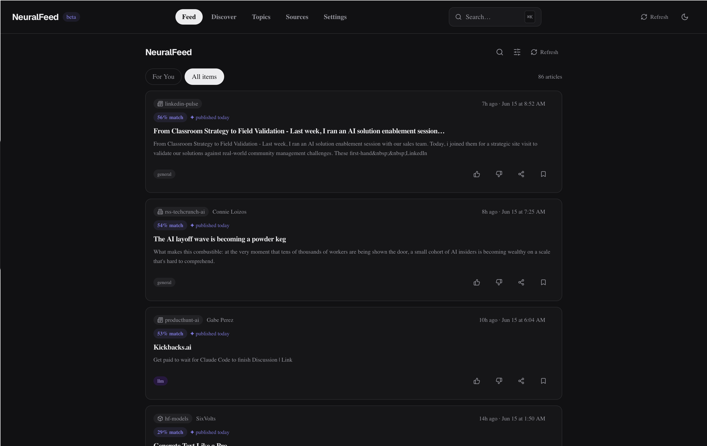
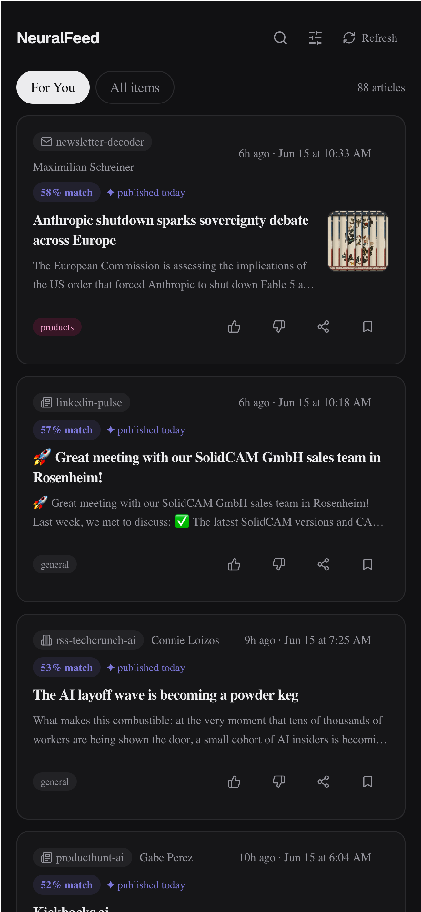
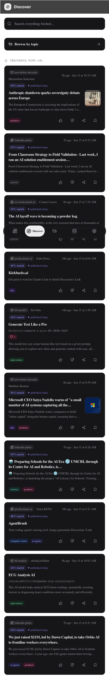
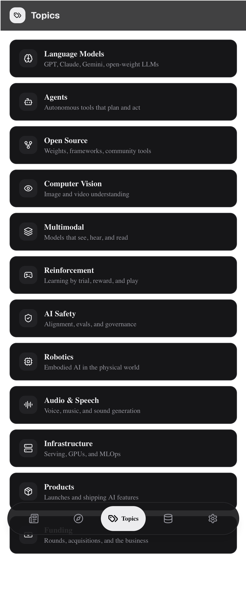
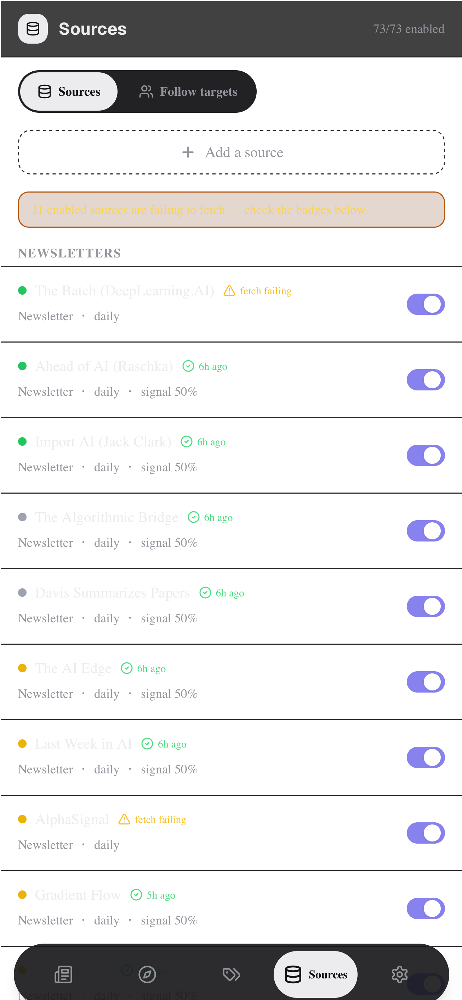
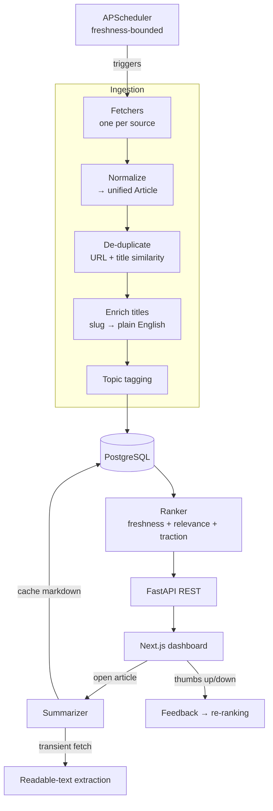

# NeuralFeed

**An AI-news intelligence dashboard.** One place that tracks everything moving in AI — research, code, social, and company blogs — deduplicates it, ranks it by freshness and relevance, summarizes it on demand, and links you straight to the source.

<p>
  
  
  
  
  
  
</p>

[**Live demo**](https://neuralfeed.vercel.app) · [Backend API](https://neuralfeed-api.onrender.com/health)

<sub>Runs as a single-user instance — auth scopes the feed and preferences to one account rather than offering public multi-tenant sign-ups.</sub>



<table>
  <tr>
    <td width="50%"><br/><sub><b>On-demand LLM summary</b> — a structured brief (TL;DR · What it is · Why it matters · How it works), generated on tap</sub></td>
    <td width="50%"><br/><sub><b>Discover</b> — search everything fetched + trending now</sub></td>
  </tr>
  <tr>
    <td width="50%"><br/><sub><b>Topics</b> — browse by theme (LLMs, Agents, CV…)</sub></td>
    <td width="50%"><br/><sub><b>Sources</b> — per-source enable/disable & health</sub></td>
  </tr>
</table>

---

## Contents

- [The problem](#the-problem)
- [Features](#features)
- [How it works](#how-it-works)
- [Tech stack](#tech-stack)
- [API overview](#api-overview)
- [Project structure](#project-structure)
- [Running locally](#running-locally)
- [Testing](#testing)
- [Security](#security)
- [Status & roadmap](#status--roadmap)
- [How it was built](#how-it-was-built)

---

## The problem

AI moves fast enough that missing two weeks means falling behind. Every useful source — arXiv, Reddit, GitHub, Hugging Face, company blogs — lives on a different platform engineered to keep you *inside* it. NeuralFeed inverts that: it fetches the signal, deduplicates and ranks it, and sends you to the original source. You never read content here; NeuralFeed only decides *which* content deserves your attention today.

**Design principle — curator, not a copy machine.** NeuralFeed stores only metadata (title, URL, source, author, date, a short snippet, and a hotlinked preview-image URL). It never stores full article text or third-party images. Article text is fetched *transiently* for summarization and immediately discarded.

---

## Features

### Aggregation
- **9+ sources across categories:** arXiv (cs.AI / cs.LG / cs.CL / cs.CV), Reddit (r/MachineLearning, r/LocalLLaMA, r/artificial), GitHub Trending, Hacker News, Hugging Face (papers, models, spaces), YouTube channels, and company/blog RSS (OpenAI, Anthropic, DeepMind, Hugging Face, Meta AI, and more).
- **Unified schema:** every item from every source is normalized into one `Article` shape, so the feed is consistent regardless of origin.
- **Resilient fetching:** exponential backoff on `429`/`503`, `Retry-After` honored, descriptive user agents, and SSRF-guarded content extraction.

### Ranking & de-duplication
- **Cross-source de-duplication:** the same story surfacing on Reddit, HN, and a blog is collapsed via URL-exact + title-similarity matching.
- **Freshness-first ranking:** a composite of recency, a per-item **relevance** score, and **traction** (engagement signal from the origin platform). The feed stays **finite and signal-dense** — deliberately *no* infinite doom-scroll.
- **Plain-English titles:** slug-named items (e.g. `owner/wan2-2-fp8da`) are rewritten into readable headlines via an LLM, with a deterministic fallback so nothing ever shows a raw slug.
- **Topic tagging:** items are auto-tagged (LLMs, CV, Multimodal, RL, AI Safety, Agents, Open Source, Infrastructure, Products, Funding…).

### Reading & summaries
- **On-demand LLM summaries:** a structured "5-minute brief" — **TL;DR → What it is → Why it matters → How it works → What's new → Who should care** — written for a reader who may know nothing about AI.
- **Source-aware extraction:** Reddit threads pull the post + top comments; GitHub/Hugging Face pull the README/model card; everything else uses readable-text extraction (trafilatura). On extraction failure it summarizes from the stored title + snippet rather than erroring.
- **Cached & quota-aware:** each summary is cached on the article row (generated once), and model routing keeps usage within free-tier limits — a cheaper model for bulk title enrichment, a stronger model for summaries, with automatic fallback if the strong model is rate-limited.

### Discovery & filtering
- **Discover:** full-text search across everything fetched, plus a "Trending now" section.
- **Topics:** browse the feed by theme.
- **Advanced filters (combinable):** content type, platform, topic tag, time range, source quality, read status, feedback, and trending.
- **Source management:** enable/disable each source, see per-source health (which sources are failing to fetch) and rolling signal score.

### Personalization & feedback
- **Thumbs up/down** on every card (optimistic UI, persisted immediately) feeds back into ranking.
- **Read / bookmark state** scoped per user.
- **Share** on every card and in the reader (Web Share API with clipboard fallback).

### Platform
- **Mobile-first, responsive** (single-column mobile → multi-column desktop), **dark mode** by default.
- **JWT auth**, login-first gate, scheduled background ingestion, and production deployment on free tiers.

---

## How it works

The system is a pipeline from raw sources to a ranked, summarizable feed:



**1. Scheduling.** An in-process **APScheduler** triggers each source on its own cadence, clamped by a global freshness bound (`REFRESH_MAX_HOURS`) so no source ever waits too long between fetches. A manual "Refresh now" is always available.

**2. Fetching & normalization.** Each source has a dedicated fetcher module that calls its API/RSS/scrape path, with backoff and rate-limit handling, and maps the response into one unified `Article` schema (id, title, url, source, author, published date, snippet, topic tags, image URL).

**3. De-duplication.** New items are matched against existing ones by exact URL and by title similarity, so a story appearing on multiple platforms is stored once.

**4. Enrichment & tagging.** Slug-shaped titles are rewritten into readable headlines (LLM, with a zero-API deterministic fallback), and each item is auto-tagged with topic labels. Title enrichment runs in bounded batches on a schedule to stay within LLM free-tier quota.

**5. Ranking.** On each feed request the ranker scores items by a freshness-first composite (recency + relevance + platform traction), incorporating the user's thumbs up/down history. The result is a finite, de-duplicated, signal-dense feed — cached briefly for performance.

**6. Summarization (on demand).** When you open an article, the summarizer fetches the page text *transiently* (source-aware: Reddit comments, GitHub READMEs, or readable-text extraction), sends it to the LLM with a structured-brief prompt, caches the resulting markdown on the article row, and never persists the raw page text. Repeat opens serve the cache instantly.

**7. Feedback loop.** Thumbs up/down and read/bookmark state are stored per user and feed back into future ranking.

---

## Tech stack

| Layer | Technology |
|---|---|
| Frontend | Next.js 15 (App Router, React 19), Tailwind CSS, TanStack Query |
| Backend | Python FastAPI (async, fully type-annotated), SQLAlchemy 2.x |
| Scheduling | APScheduler (in-process) |
| Database | SQLite (dev) → PostgreSQL / Neon (prod) |
| Summaries / LLM | Groq (Ollama for offline dev) |
| Auth | JWT (HS256), PBKDF2 password hashing |
| Hosting | Vercel (frontend) · Render (backend) · Neon (Postgres) |
| Tooling | `uv` (Python), `bun` (frontend), Ruff, pytest, Vitest |

## API overview

A REST API under `/api/v1`, documented automatically via FastAPI's OpenAPI (`/docs`):

| Resource | Purpose |
|---|---|
| `GET /feed` | Ranked, filtered, paginated feed |
| `GET /articles/{id}/summary` | Cached-or-generated structured summary |
| `GET /sources` | Source registry + per-source health/signal |
| `POST /feedback` | Thumbs up/down, read, bookmark |
| `GET/PUT /preferences` | Per-user preferences |
| `GET /topics` | Topic taxonomy + per-topic feeds |
| `POST /auth/*` | Register / login (JWT) |

## Project structure

```
backend/          FastAPI service
  app/
    api/v1/        REST route handlers (feed, articles, sources, feedback, …)
    fetchers/      One module per source (arXiv, Reddit, GitHub, HN, HF, YouTube, RSS, …)
    services/      ingest, dedupe, ranker, relevance, traction, summarizer,
                   enricher, topic_tagger, preference_learner, auth, user_state
    models/        SQLAlchemy models (Article, Source, User, preferences, state)
    core/          config, DB session, scheduler, rate limiting, caching, net/SSRF guard
  tests/           pytest (services, fetchers, api, core)
frontend/          Next.js 15 app
  app/             routes: feed, discover, topics, sources, settings, login
  components/       FeedCard, SummarySheet, filters, source badges, …
  hooks/  lib/      API client + React Query hooks
docs/              ROADMAP, SOURCES registry, ADRs, screenshots
```

## Running locally

**Backend**
```bash
cd backend
cp .env.example .env        # add your GROQ_API_KEY (free at console.groq.com)
uv sync
uv run uvicorn app.main:app --reload
```

**Frontend**
```bash
cd frontend
echo "NEXT_PUBLIC_API_URL=http://localhost:8000" > .env.local
bun install
bun dev
```

Open http://localhost:3000. On first run the backend seeds the source registry and the scheduler begins fetching. (No `GROQ_API_KEY`? The app still runs — summaries simply return a friendly "configure a key" message.)

## Testing

- **Backend:** `pytest` with `pytest-asyncio`; integration tests run against in-memory SQLite (a real DB, never mocked), external HTTP is mocked. ~84% coverage across `services/`, `fetchers/`, `core/`.
- **Frontend:** Vitest + React Testing Library smoke tests on core components.

```bash
cd backend && uv run pytest          # backend suite
cd frontend && bun test              # frontend smoke tests
```

## Security

- **Auth:** PBKDF2 (600k iterations) password hashing; HS256 JWT (7-day expiry); the server refuses to boot with a default secret when auth is required.
- **Authorization:** every read/write is scoped to the JWT's user id (per-user article state; preferences namespaced per user).
- **Hardening:** per-IP rate limiting (stricter on auth, looser on writes), CORS locked to explicit origins/methods/headers, security headers (HSTS, `nosniff`, frame-deny, no-referrer, no-store).
- **Untrusted input:** all external data (RSS, API responses, scraped HTML) is treated as untrusted and sanitized; the summarizer's page fetch is **SSRF-guarded**, blocking private/loopback/metadata addresses on the initial request and every redirect hop. No `eval` / dynamic execution on fetched content.
- **Secrets** live only in environment variables; `.env.example` is the committed template.

## Status & roadmap

Live and actively used daily — frontend on Vercel, async FastAPI backend on Render, PostgreSQL on Neon. Ongoing work focuses on ranking quality, more sources, and deeper feed personalization. See [`docs/ROADMAP.md`](docs/ROADMAP.md).

## How it was built

NeuralFeed was designed and built **AI-natively, using [Claude Code](https://claude.com/claude-code)** as a development partner. I drove the architecture, product decisions, and review; the AI accelerated implementation — letting me move from idea to working feature with minimal friction and iterate on the design, fetchers, ranking, and infrastructure far faster than solo hand-coding.

This is deliberate: working fluently *with* AI tooling — specifying intent clearly, reviewing generated code critically, and keeping a tight quality bar (conventional commits, ~84% test coverage, security review) — is how I prefer to ship. The goal is to turn ideas into shipped software quickly without sacrificing engineering rigor.

---

*Built by [Atharv Motghare](https://github.com/rvzaku) with [Claude Code](https://claude.com/claude-code). Not affiliated with any of the sources it aggregates.*
